# Pani - Complete Application Architecture

## System Overview

Pani is a modern hiring platform built with React, TypeScript, and Supabase that connects candidates with employers through AI-powered matching and event-based hiring campaigns.

---

## High-Level Architecture

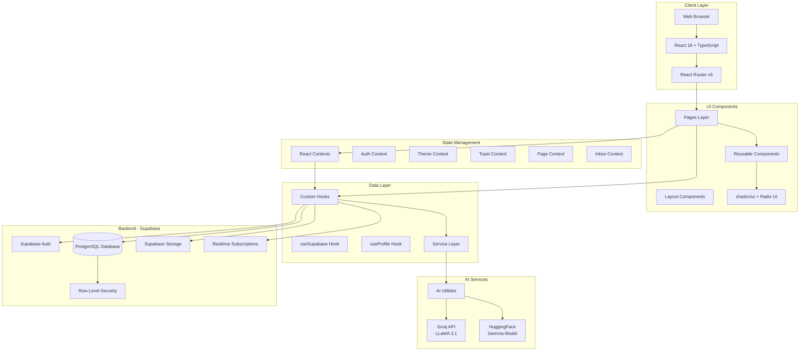

---

## Database Schema

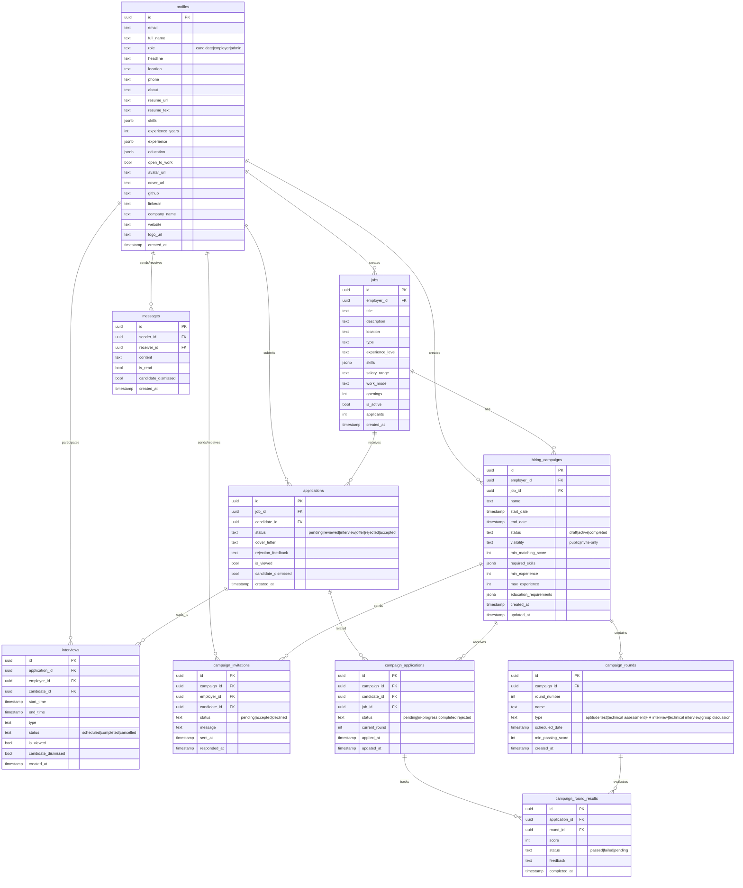

---

## Application Flow - User Roles

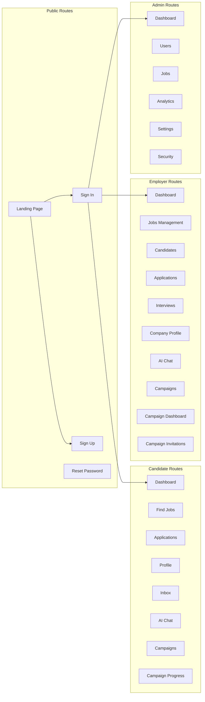

---

## Authentication & Authorization Flow

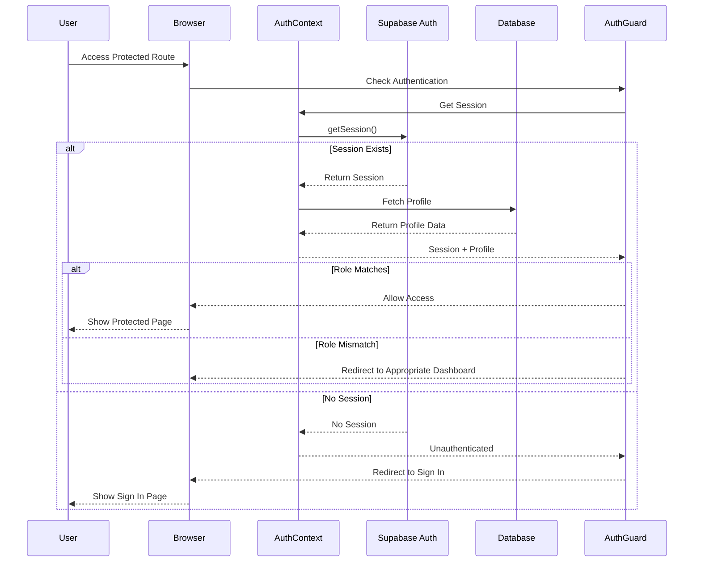

---

## Data Flow - Job Application Process

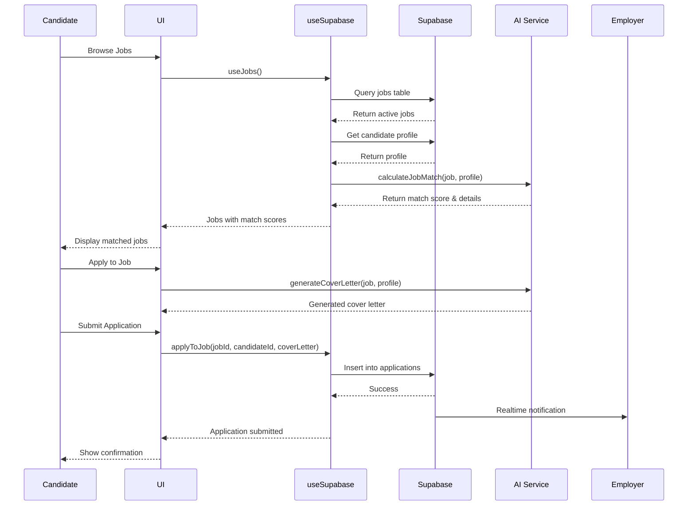

---

## AI Integration Architecture

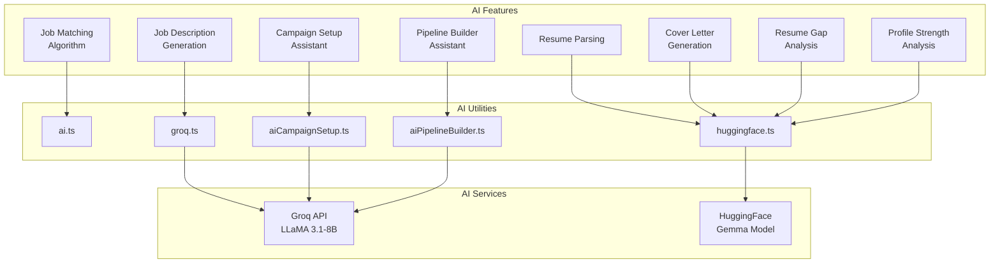

---

## Campaign System Architecture

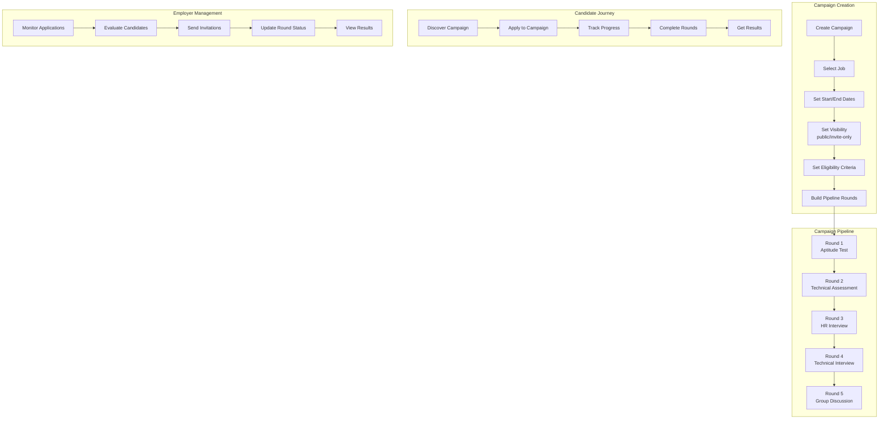

---

## Realtime Features

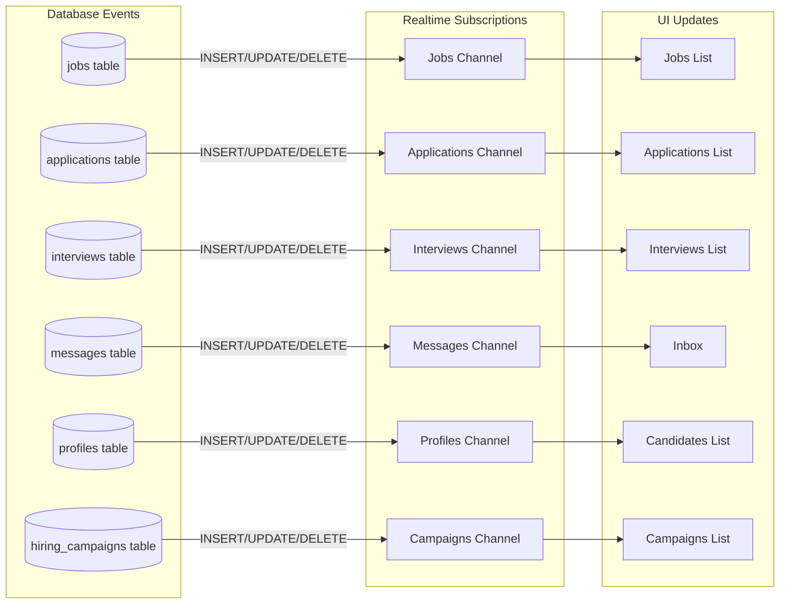

---

## Security Architecture (RLS)

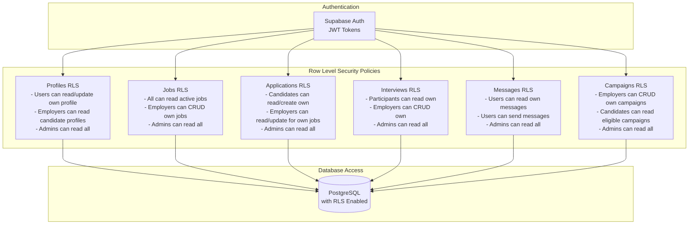

---

## Technology Stack

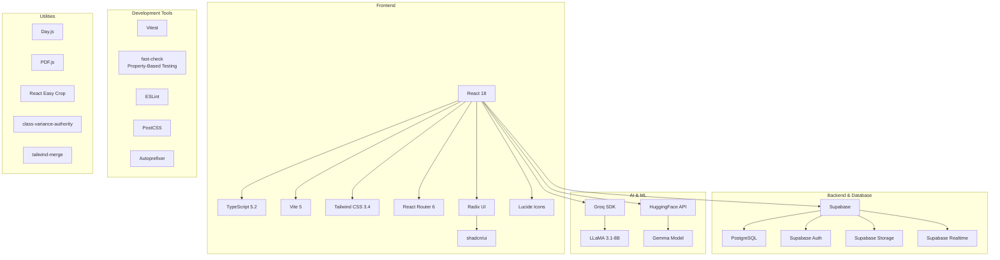

---

## File Structure

```
pani-vite/
├── src/
│   ├── components/          # Reusable UI components
│   │   ├── admin/          # Admin-specific components
│   │   ├── common/         # Shared components
│   │   ├── dashboard/      # Candidate dashboard components
│   │   ├── employer/       # Employer-specific components
│   │   └── ui/             # shadcn/ui components
│   ├── contexts/           # React Context providers
│   │   ├── AuthContext.tsx
│   │   ├── ThemeContext.tsx
│   │   ├── ToastContext.tsx
│   │   ├── PageContext.tsx
│   │   └── InboxContext.tsx
│   ├── hooks/              # Custom React hooks
│   │   └── useSupabase.ts  # Main data fetching hook
│   ├── pages/              # Route pages
│   │   ├── admin/          # Admin pages
│   │   ├── employer/       # Employer pages
│   │   └── [candidate pages]
│   ├── services/           # Business logic & external services
│   │   ├── groq.ts
│   │   ├── huggingface.ts
│   │   ├── aiCampaignSetup.ts
│   │   ├── aiPipelineBuilder.ts
│   │   └── campaignNotifications.ts
│   ├── utils/              # Utility functions
│   │   ├── ai.ts           # AI utilities
│   │   ├── pdf.ts          # PDF utilities
│   │   ├── pdfParser.ts
│   │   ├── cropImage.ts
│   │   ├── eligibilityChecker.ts
│   │   └── supabase/
│   │       └── client.ts   # Supabase client
│   ├── App.tsx             # Main app component with routing
│   ├── main.tsx            # Entry point
│   └── index.css           # Global styles
├── supabase/               # Database migrations & SQL
│   ├── create_campaign_tables.sql
│   ├── campaign_rls_policies.sql
│   ├── enable_realtime.sql
│   └── [other migrations]
├── public/                 # Static assets
├── .env                    # Environment variables
├── package.json
├── vite.config.ts
├── tailwind.config.js
└── tsconfig.json
```

---

## Key Features Summary

### For Candidates
- **AI-Powered Job Matching**: Intelligent matching algorithm with detailed breakdown
- **Resume Parsing**: Automatic profile population from uploaded resume
- **AI Cover Letter Generation**: Context-aware cover letter creation
- **Campaign Participation**: Apply to multi-round hiring campaigns
- **Progress Tracking**: Track application and campaign progress
- **Inbox System**: Unified inbox for interviews, messages, and updates
- **Profile Optimization**: AI-powered profile strength analysis

### For Employers
- **AI Job Description Generator**: Create compelling job postings with AI
- **Candidate Discovery**: Browse candidates with match scores
- **Application Management**: Review and manage applications
- **Interview Scheduling**: Schedule and manage interviews
- **Campaign Creation**: Create event-based hiring campaigns with multi-round pipelines
- **AI Pipeline Builder**: AI-assisted pipeline creation
- **Invitation System**: Invite specific candidates to campaigns
- **Analytics Dashboard**: Track hiring metrics and pipeline status

### For Admins
- **User Management**: Manage all users and roles
- **Job Moderation**: Oversee all job postings
- **Analytics**: System-wide analytics and insights
- **Security Settings**: Configure security policies
- **System Settings**: Manage platform configuration

---

## Performance Optimizations

1. **Module-level Profile Caching**: Prevents sidebar flashing on remount
2. **Realtime Subscriptions**: Efficient data synchronization
3. **Lazy Loading**: Code splitting for route-based components
4. **Optimistic Updates**: Immediate UI feedback before server confirmation
5. **Indexed Database Queries**: Optimized database indexes for frequent queries
6. **Connection Pooling**: Efficient database connection management via Supabase

---

## Security Features

1. **Row Level Security (RLS)**: Database-level access control
2. **JWT Authentication**: Secure token-based authentication
3. **Role-Based Access Control**: Candidate, Employer, Admin roles
4. **Secure File Storage**: Protected resume and media storage
5. **Input Validation**: Client and server-side validation
6. **SQL Injection Prevention**: Parameterized queries via Supabase
7. **XSS Protection**: React's built-in XSS protection

---

## Deployment Architecture

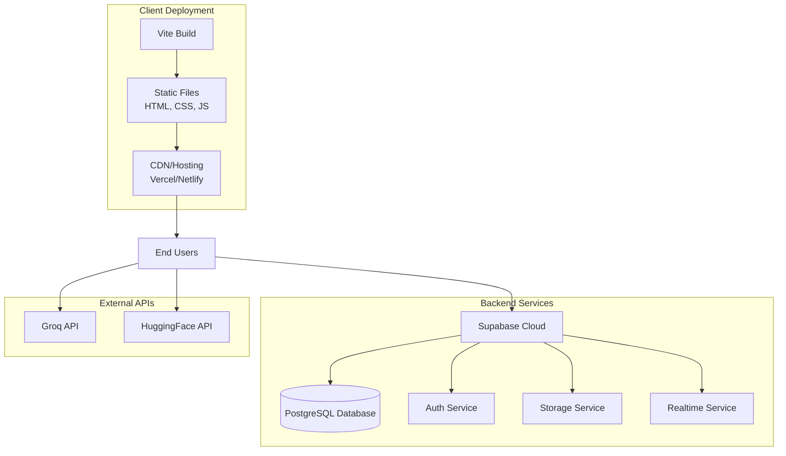

---

## Future Enhancements

1. **Video Interviews**: Integrated video calling for remote interviews
2. **Advanced Analytics**: ML-powered hiring insights
3. **Mobile Apps**: Native iOS and Android applications
4. **API Integration**: Third-party ATS integrations
5. **Advanced Notifications**: Push notifications and email alerts
6. **Skill Assessments**: Built-in coding challenges and assessments
7. **Team Collaboration**: Multi-user employer accounts
8. **Candidate Pools**: Talent pool management for employers

---

## Environment Variables

```env
# Supabase
VITE_SUPABASE_URL=your_supabase_url
VITE_SUPABASE_ANON_KEY=your_supabase_anon_key

# AI Services
VITE_GROQ_API_KEY=your_groq_api_key
VITE_HUGGINGFACE_API_KEY=your_huggingface_api_key
```

---

## Getting Started

```bash
# Install dependencies
npm install

# Set up environment variables
cp .env.example .env
# Edit .env with your credentials

# Run database migrations
# Execute SQL files in supabase/ directory in Supabase Dashboard

# Start development server
npm run dev

# Build for production
npm run build

# Run tests
npm run test
```

---

## License

[Your License Here]

---

## Contributors

[Your Team/Contributors Here]
