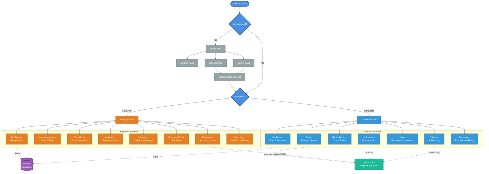
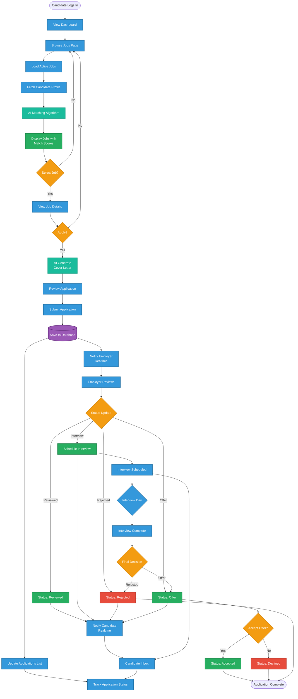
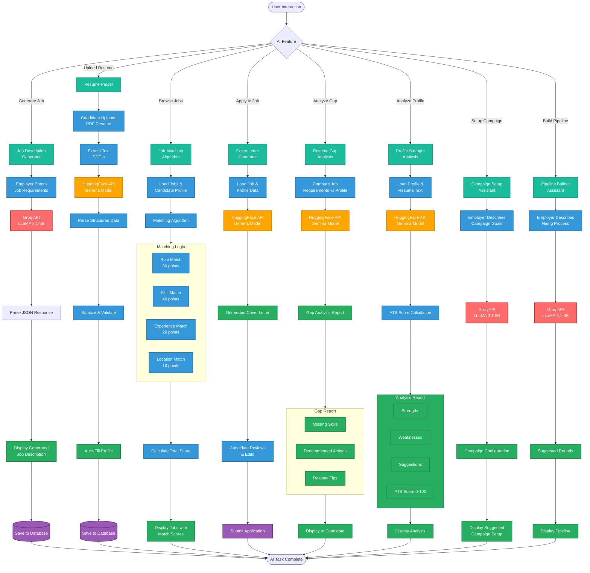
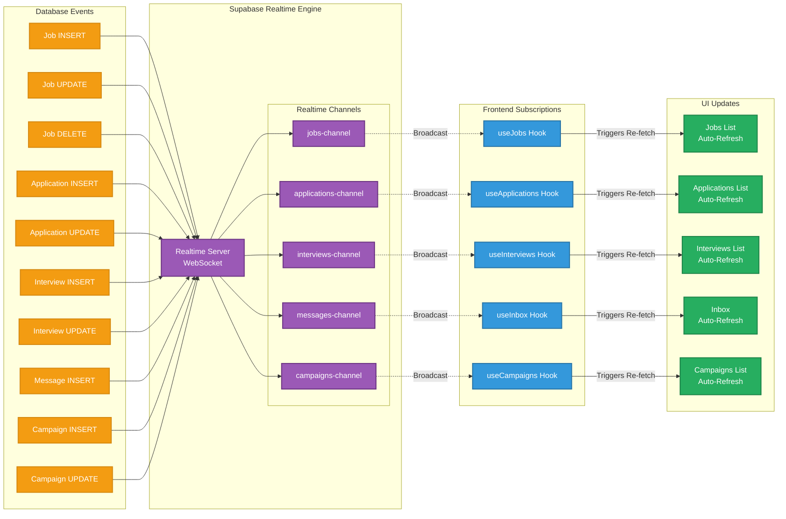

# Pani - Application Block Diagrams

## Complete Application Block Diagram

---

## Job Application Flow Block Diagram

---

## Campaign System Block Diagram

```mermaid
graph TB
    %% Employer Creates Campaign
    Start([Employer Logs In])
    Start --> EmpDash[Employer Dashboard]
    EmpDash --> CampaignPage[Campaigns Page]
    
    %% Create Campaign
    CampaignPage --> CreateBtn[Click Create Campaign]
    CreateBtn --> SelectJob[Select Job Posting]
    SelectJob --> SetDetails[Set Campaign Details]
    
    subgraph CampaignDetails["Campaign Configuration"]
        Name[Campaign Name]
        Dates[Start & End Dates]
        Visibility[Visibility<br/>public/invite-only]
        Criteria[Eligibility Criteria<br/>Skills, Experience]
    end
    
    SetDetails --> CampaignDetails
    CampaignDetails --> BuildPipeline[Build Pipeline]
    
    %% Pipeline Builder
    subgraph PipelineRounds["Pipeline Rounds"]
        Round1[Round 1<br/>Aptitude Test]
        Round2[Round 2<br/>Technical Assessment]
        Round3[Round 3<br/>HR Interview]
        Round4[Round 4<br/>Technical Interview]
        Round5[Round 5<br/>Group Discussion]
    end
    
    BuildPipeline --> PipelineRounds
    PipelineRounds --> SaveCampaign[(Save Campaign<br/>Status: Draft)]
    
    %% Activate Campaign
    SaveCampaign --> ReviewCampaign[Review Campaign]
    ReviewCampaign --> ActivateDecision{Activate?}
    ActivateDecision -->|No| EditCampaign[Edit Campaign]
    EditCampaign --> ReviewCampaign
    ActivateDecision -->|Yes| ActivateCampaign[Activate Campaign<br/>Status: Active]
    
    %% Candidate Discovery
    ActivateCampaign --> PublishCampaign[Publish Campaign]
    PublishCampaign --> CandidateView{Visibility Type}
    
    CandidateView -->|Public| AllCandidates[All Eligible<br/>Candidates See It]
    CandidateView -->|Invite-Only| SendInvites[Send Invitations<br/>to Selected Candidates]
    
    %% Candidate Application
    AllCandidates --> CandApply[Candidate Applies]
    SendInvites --> InviteReceived[Candidate Receives<br/>Invitation]
    InviteReceived --> AcceptInvite{Accept?}
    AcceptInvite -->|Yes| CandApply
    AcceptInvite -->|No| DeclineInvite[Decline Invitation]
    
    %% Application Processing
    CandApply --> CheckEligibility[Check Eligibility<br/>Match Score, Skills]
    CheckEligibility --> EligibleDecision{Eligible?}
    EligibleDecision -->|No| RejectApp[Reject Application]
    EligibleDecision -->|Yes| CreateAppRecord[(Create Application<br/>current_round: 0)]
    
    %% Round Progression
    CreateAppRecord --> StartRound1[Start Round 1]
    
    subgraph RoundFlow["Round Progression Flow"]
        TakeTest[Candidate Takes Test/<br/>Attends Interview]
        SubmitResult[Submit Results]
        EvaluateScore[Evaluate Score]
        PassDecision{Pass?}
        NextRound[Move to Next Round]
        FailRound[Fail - Reject]
    end
    
    StartRound1 --> RoundFlow
    TakeTest --> SubmitResult
    SubmitResult --> EvaluateScore
    EvaluateScore --> PassDecision
    PassDecision -->|Yes| NextRound
    PassDecision -->|No| FailRound
    
    %% Round Iteration
    NextRound --> CheckMoreRounds{More Rounds?}
    CheckMoreRounds -->|Yes| TakeTest
    CheckMoreRounds -->|No| AllRoundsComplete[All Rounds Complete]
    
    %% Final Outcomes
    AllRoundsComplete --> FinalEvaluation[Final Evaluation]
    FinalEvaluation --> FinalDecision{Hire?}
    FinalDecision -->|Yes| SendOffer[Send Job Offer]
    FinalDecision -->|No| RejectFinal[Reject Application]
    
    SendOffer --> CandidateResponse{Candidate Response}
    CandidateResponse -->|Accept| Hired[Status: Hired]
    CandidateResponse -->|Decline| OfferDeclined[Offer Declined]
    
    %% End States
    RejectApp --> End([Campaign Application End])
    FailRound --> End
    RejectFinal --> End
    Hired --> End
    OfferDeclined --> End
    DeclineInvite --> End
    
    %% Employer Monitoring
    ActivateCampaign -.-> MonitorDashboard[Campaign Dashboard<br/>Monitor Progress]
    MonitorDashboard -.-> ViewApplicants[View Applicants]
    MonitorDashboard -.-> ViewRoundResults[View Round Results]
    MonitorDashboard -.-> SendInvites
    
    %% Styling
    classDef startClass fill:#4A90E2,stroke:#2E5C8A,stroke-width:3px,color:#fff
    classDef employerClass fill:#E67E22,stroke:#CA6F1E,stroke-width:2px,color:#fff
    classDef candidateClass fill:#3498DB,stroke:#2874A6,stroke-width:2px,color:#fff
    classDef processClass fill:#1ABC9C,stroke:#16A085,stroke-width:2px,color:#fff
    classDef decisionClass fill:#F39C12,stroke:#D68910,stroke-width:2px,color:#fff
    classDef dbClass fill:#9B59B6,stroke:#6C3483,stroke-width:2px,color:#fff
    classDef successClass fill:#27AE60,stroke:#1E8449,stroke-width:2px,color:#fff
    classDef rejectClass fill:#E74C3C,stroke:#C0392B,stroke-width:2px,color:#fff
    classDef endClass fill:#95A5A6,stroke:#7F8C8D,stroke-width:3px,color:#fff
    
    class Start,End startClass,endClass
    class EmpDash,CampaignPage,CreateBtn,SelectJob,SetDetails,BuildPipeline,ReviewCampaign,EditCampaign,PublishCampaign,MonitorDashboard,ViewApplicants,ViewRoundResults employerClass
    class CandApply,InviteReceived,TakeTest,SubmitResult candidateClass
    class Name,Dates,Visibility,Criteria,Round1,Round2,Round3,Round4,Round5,CheckEligibility,EvaluateScore,FinalEvaluation processClass
    class ActivateDecision,CandidateView,AcceptInvite,EligibleDecision,PassDecision,CheckMoreRounds,FinalDecision,CandidateResponse decisionClass
    class SaveCampaign,CreateAppRecord dbClass
    class ActivateCampaign,AllCandidates,SendInvites,NextRound,AllRoundsComplete,SendOffer,Hired successClass
    class RejectApp,FailRound,RejectFinal,OfferDeclined,DeclineInvite rejectClass
```

---

## AI Integration Block Diagram

---

## Realtime Updates Block Diagram

---

## Legend

- **Solid Lines (→)**: Direct synchronous flow
- **Dashed Lines (-.->)**: Asynchronous updates or broadcasts
- **Diamond Shapes (◇)**: Decision points
- **Rounded Rectangles**: Processes or actions
- **Cylinders**: Database operations
- **Subgraphs**: Logical grouping of related components
- **Colors**: Different layers/concerns in the application
