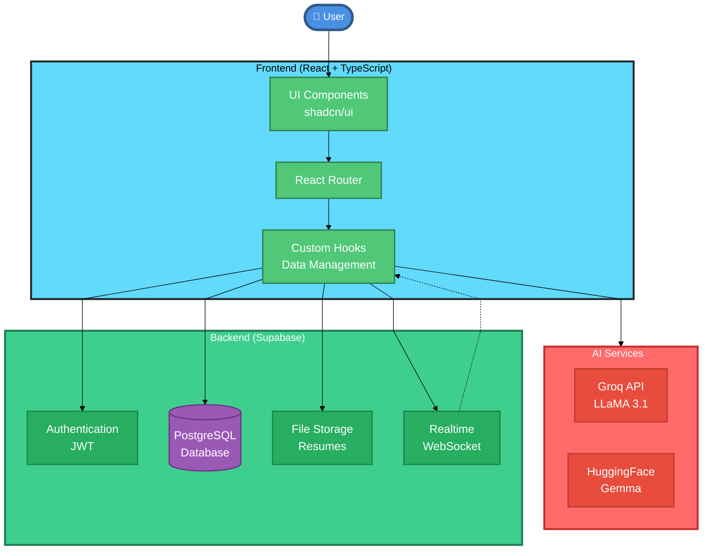
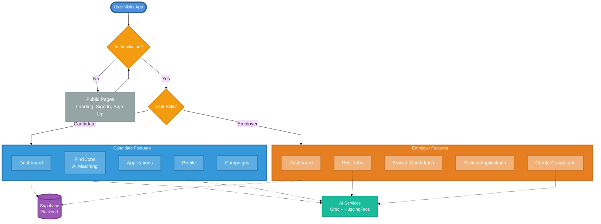
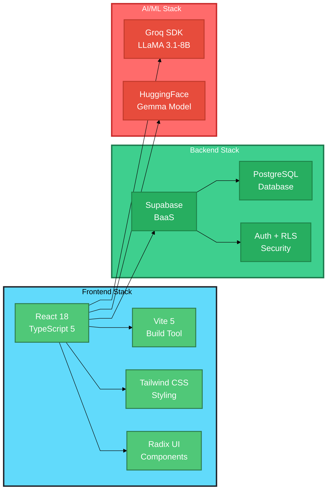
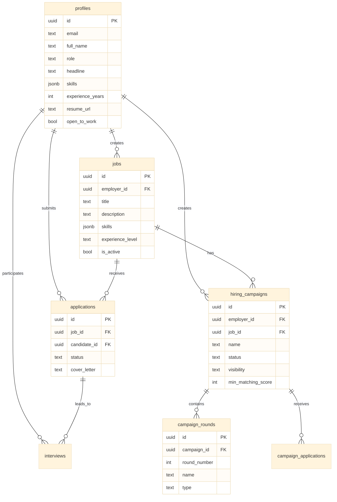
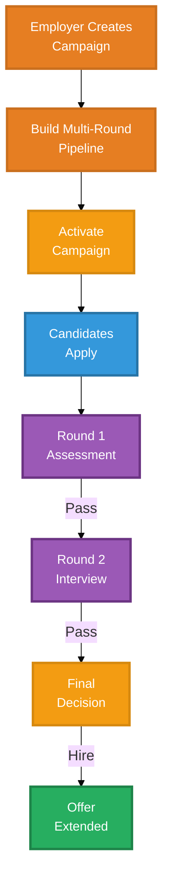
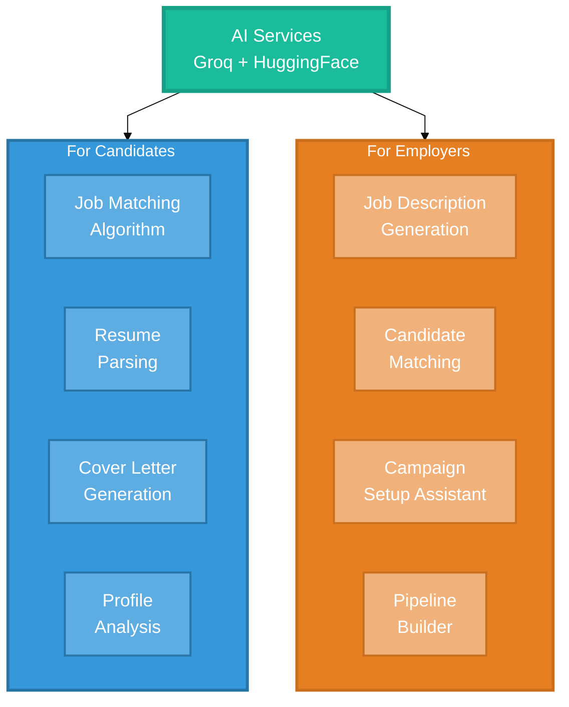

# Pani - Presentation Diagrams

## System Architecture (Presentation Version)



---

## Application Block Diagram (Presentation Version)



---

## Technology Stack (Presentation Version)



---

## Database Schema (Presentation Version)



---

## Job Application Flow (Presentation Version)


---

## Campaign System Flow (Presentation Version)



---

## AI Features Overview (Presentation Version)



---

## How to Export to PNG

### Method 1: Using Mermaid Live Editor (Recommended)
1. Go to https://mermaid.live/
2. Copy any diagram code from above
3. Paste into the editor
4. Click "Actions" → "PNG" or "SVG"
5. Download the image

### Method 2: Using VS Code Extension
1. Install "Markdown Preview Mermaid Support" extension
2. Open this file in VS Code
3. Right-click on the preview
4. Select "Copy Image" or use a screenshot tool

### Method 3: Using CLI Tool
```bash
npm install -g @mermaid-js/mermaid-cli
mmdc -i PRESENTATION_DIAGRAMS.md -o diagram.png -w 1920 -H 1080
```

---

## Presentation Tips

- **System Architecture**: Best for technical overview slide
- **Application Block Diagram**: Best for user flow explanation
- **Technology Stack**: Best for tech stack slide
- **Database Schema**: Best for data model slide
- **Job Application Flow**: Best for feature demo
- **Campaign System Flow**: Best for campaign feature explanation
- **AI Features Overview**: Best for AI capabilities slide

All diagrams are optimized for:
- ✅ 16:9 aspect ratio (standard presentation)
- ✅ Large, readable fonts (18px)
- ✅ High contrast colors
- ✅ Clear visual hierarchy
- ✅ Minimal text per node
- ✅ Logical flow direction
