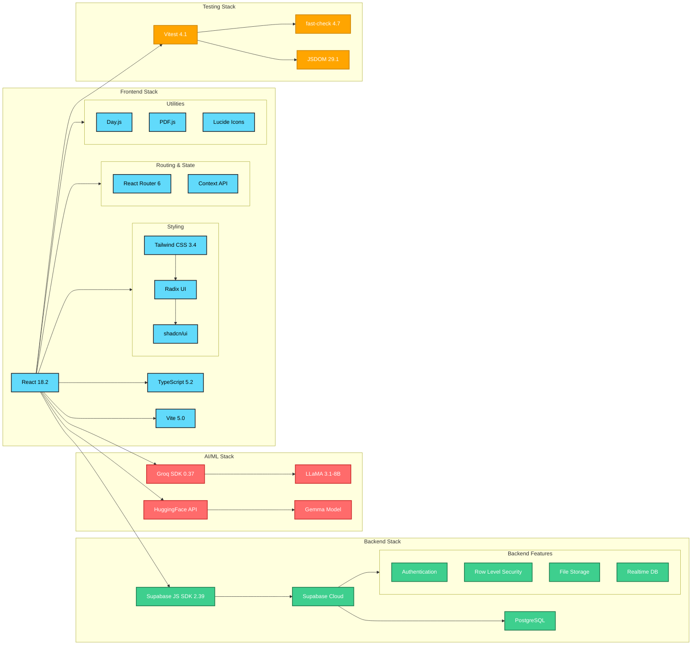
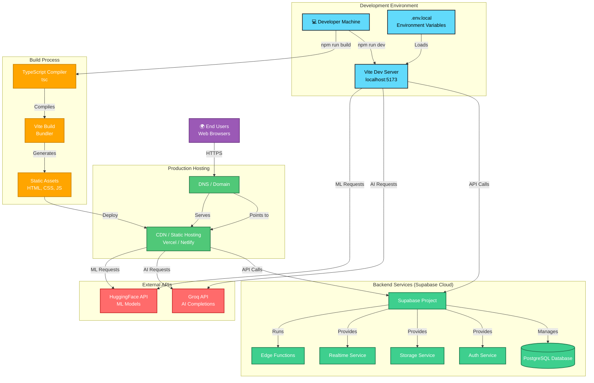
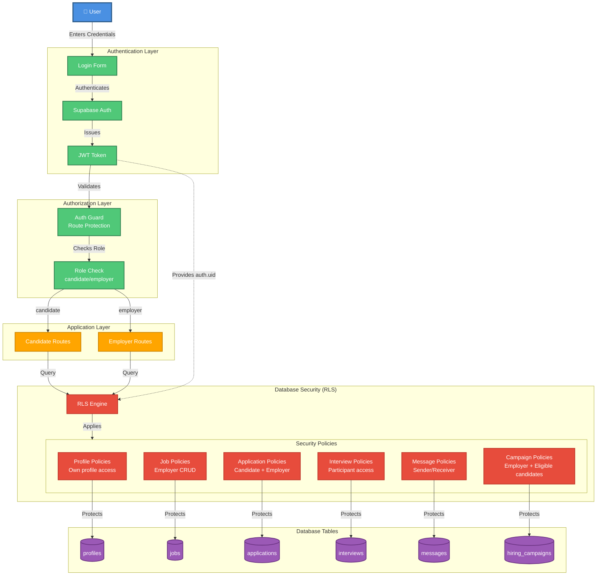
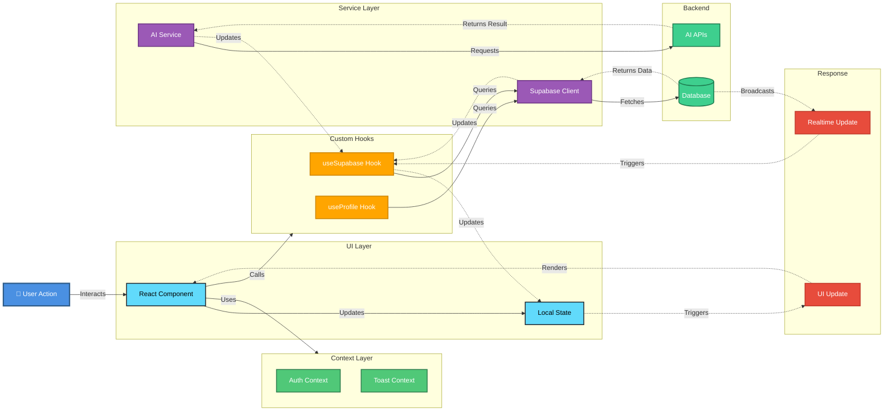

# Pani - System Architecture

## Complete System Architecture Diagram

```mermaid
graph TB
    %% Client Layer
    User[👤 End User]
    Browser[🌐 Web Browser]
    
    %% Frontend Application
    subgraph Frontend["Frontend Application (React + TypeScript)"]
        Router[React Router v6]
        
        subgraph Contexts["Context Providers"]
            AuthCtx[Auth Context]
            ThemeCtx[Theme Context]
            ToastCtx[Toast Context]
            PageCtx[Page Context]
            InboxCtx[Inbox Context]
        end
        
        subgraph Pages["Pages Layer"]
            PublicPages[Public Pages<br/>Landing, SignIn, SignUp]
            CandidatePages[Candidate Pages<br/>Dashboard, Jobs, Profile]
            EmployerPages[Employer Pages<br/>Dashboard, Candidates, Campaigns]
        end
        
        subgraph Components["UI Components"]
            UILib[shadcn/ui + Radix UI]
            CustomComponents[Custom Components]
            Layouts[Layout Components]
        end
        
        subgraph DataLayer["Data Layer"]
            Hooks[Custom Hooks<br/>useSupabase, useProfile]
            Services[Services<br/>AI, Notifications]
        end
    end
    
    %% AI Services
    subgraph AIServices["AI Services"]
        GroqAPI[Groq API<br/>LLaMA 3.1-8B]
        HuggingFace[HuggingFace<br/>Gemma Model]
    end
    
    %% Backend Services
    subgraph Backend["Backend (Supabase)"]
        SupabaseAuth[Supabase Auth<br/>JWT Tokens]
        
        subgraph Database["PostgreSQL Database"]
            ProfilesTable[(profiles)]
            JobsTable[(jobs)]
            ApplicationsTable[(applications)]
            InterviewsTable[(interviews)]
            MessagesTable[(messages)]
            CampaignsTable[(hiring_campaigns)]
            RoundsTable[(campaign_rounds)]
            CampAppsTable[(campaign_applications)]
            ResultsTable[(campaign_round_results)]
            InvitationsTable[(campaign_invitations)]
        end
        
        RLS[Row Level Security<br/>Policies]
        Storage[Supabase Storage<br/>Resumes, Media]
        Realtime[Realtime Subscriptions<br/>WebSocket]
    end
    
    %% Connections - User to Browser
    User -->|Interacts| Browser
    
    %% Browser to Frontend
    Browser -->|Loads| Router
    
    %% Router to Pages
    Router -->|Routes| PublicPages
    Router -->|Routes| CandidatePages
    Router -->|Routes| EmployerPages
    
    %% Pages to Contexts
    PublicPages -->|Uses| Contexts
    CandidatePages -->|Uses| Contexts
    EmployerPages -->|Uses| Contexts
    
    %% Pages to Components
    PublicPages -->|Renders| Components
    CandidatePages -->|Renders| Components
    EmployerPages -->|Renders| Components
    
    %% Components to UI Library
    CustomComponents -->|Built with| UILib
    Layouts -->|Built with| UILib
    
    %% Pages to Data Layer
    PublicPages -->|Fetches Data| DataLayer
    CandidatePages -->|Fetches Data| DataLayer
    EmployerPages -->|Fetches Data| DataLayer
    
    %% Contexts to Hooks
    AuthCtx -->|Uses| Hooks
    InboxCtx -->|Uses| Hooks
    
    %% Hooks to Services
    Hooks -->|Calls| Services
    
    %% Services to AI
    Services -->|API Calls| GroqAPI
    Services -->|API Calls| HuggingFace
    
    %% Data Layer to Backend
    Hooks -->|Queries| SupabaseAuth
    Hooks -->|Queries| Database
    Hooks -->|Uploads| Storage
    Hooks -->|Subscribes| Realtime
    
    %% Auth to Database
    SupabaseAuth -->|Validates| RLS
    
    %% RLS to Tables
    RLS -->|Protects| ProfilesTable
    RLS -->|Protects| JobsTable
    RLS -->|Protects| ApplicationsTable
    RLS -->|Protects| InterviewsTable
    RLS -->|Protects| MessagesTable
    RLS -->|Protects| CampaignsTable
    RLS -->|Protects| RoundsTable
    RLS -->|Protects| CampAppsTable
    RLS -->|Protects| ResultsTable
    RLS -->|Protects| InvitationsTable
    
    %% Realtime to Tables
    Realtime -.->|Listens| JobsTable
    Realtime -.->|Listens| ApplicationsTable
    Realtime -.->|Listens| InterviewsTable
    Realtime -.->|Listens| MessagesTable
    Realtime -.->|Listens| CampaignsTable
    
    %% Realtime back to Frontend
    Realtime -.->|Updates| Hooks
    
    %% Styling
    classDef userClass fill:#4A90E2,stroke:#2E5C8A,stroke-width:3px,color:#fff
    classDef frontendClass fill:#50C878,stroke:#2E7D4E,stroke-width:2px,color:#fff
    classDef aiClass fill:#FF6B6B,stroke:#C92A2A,stroke-width:2px,color:#fff
    classDef backendClass fill:#9B59B6,stroke:#6C3483,stroke-width:2px,color:#fff
    classDef dbClass fill:#F39C12,stroke:#B8860B,stroke-width:2px,color:#fff
    
    class User,Browser userClass
    class Router,Contexts,Pages,Components,DataLayer,Hooks,Services frontendClass
    class GroqAPI,HuggingFace aiClass
    class SupabaseAuth,RLS,Storage,Realtime backendClass
    class ProfilesTable,JobsTable,ApplicationsTable,InterviewsTable,MessagesTable,CampaignsTable,RoundsTable,CampAppsTable,ResultsTable,InvitationsTable dbClass
```

---

## Technology Stack Architecture

---

## Deployment Architecture

---

## Security Architecture

---

## Data Flow Architecture

---

## Legend

- **Solid Lines (→)**: Direct data flow or function calls
- **Dashed Lines (-.->)**: Asynchronous updates or callbacks
- **Subgraphs**: Logical grouping of related components
- **Colors**: Different layers/concerns in the architecture
